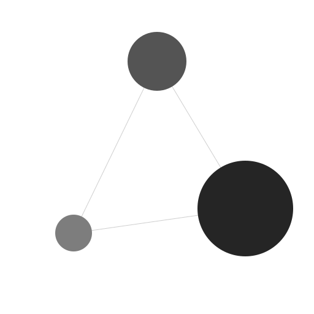

<div style="text-align: center; padding-left: 20%;">
  <table width="100%">
    <tr>
      <td align="center" bgcolor="white" style="padding: 30px;">
        
        <br>
        
      </td>
    </tr>
  </table>
</div>

<p align="center">
  <b>Enterprise-Grade Hybrid RAG Platform</b><br>
  Self-hosted AI with Vector Search, Knowledge Graphs, and Enterprise SSO
</p>

<p align="center">
  <a href="https://github.com/your-org/pandoralm/blob/main/LICENSE"></a>
  <a href="https://github.com/your-org/pandoralm/actions"></a>
  <a href="https://github.com/your-org/pandoralm/releases"></a>
  
  

</p>

---

## 📑 Table of Contents

- [Why PandoraLM?](#why-pandoralm)
- [Key Features](#key-features)
- [Architecture](#architecture)
- [Quick Start](#quick-start)
- [Kubernetes Deployment](#kubernetes-deployment)
- [Configuration](#configuration)
- [API Reference](#api-reference)
- [Architectural Decisions](#architectural-decisions)
- [Technology Stack](#technology-stack)
- [Evaluation & Quality](#evaluation--quality)
- [Contributing](#contributing)
- [License](#license)

---

## 💡 Why PandoraLM?

Traditional RAG (Retrieval Augmented Generation) systems rely solely on **vector similarity search**. This works well for simple factual questions ("What is X?") but fails on complex queries requiring relationship understanding ("How does policy A conflict with policy B?").

**PandoraLM solves this by combining:**

1. **Vector RAG** (Fast, semantic similarity) – Best for factual lookups
2. **GraphRAG** (Knowledge graphs with entity relationships) – Best for thematic, cross-document analysis
3. **Agentic Research** (Tool-use via MCP) – Best for external data and multi-step reasoning

The system uses a **Cognitive Router** (inspired by Kahneman's *Thinking, Fast and Slow*) to automatically classify queries and route them to the optimal execution path—no user intervention required.

---

## ✨ Key Features

### Core Intelligence

| Feature | Description |
|---------|-------------|
| **🧠 Cognitive Router** | LLM-based query classifier that routes between Vector, Graph, and Agentic modes |
| **🔍 Hybrid RAG** | Combines LanceDB (vectors) and Neo4j (knowledge graph) for comprehensive retrieval |
| **🚀 Cross-Encoder Reranking** | RRF fusion + `ms-marco-MiniLM` for high-precision results |
| **⚡ Semantic Router** | Sub-50ms local routing using `all-MiniLM-L6-v2` embeddings |
| **🏭 The Engine Room** | Centralized "Mission Control" for infrastructure, governance, and pipelines |
| **🎨 Glass Box UI** | Real-time "Thought Accordion" showing reasoning steps (Routing, Retrieval, Execution) |
| **🧠 KnowledgeRail** | ReBAC-aware navigation bar mapping Keycloak roles to Knowledge Layers |
| **👁️ Generative UI** | Vercel AI SDK streams triggers for Meeting Player, Graph Viz, and Code Blocks |

### Knowledge OS UI/UX

PandoraLM features a **Tri-Panel Layout** for a cohesive Knowledge OS experience:

| Panel | Purpose |
|-------|---------|
| **Global Command Rail** | Icon-based navigation (Layers, Library, Chat, Settings) |
| **Dynamic Context Panel** | Morphs based on Rail selection (Layers view or Library view) |
| **The Stage** | Main workspace/chat area |

**Active Context Features:**

| Feature | Description |
|---------|-------------|
| **🧠 KnowledgeRail** | ReBAC-aware navigation showing Knowledge Layers (System, Org, Team, User) |
| **✨ Reasoning Pulse** | Violet/Emerald glow animation indicating active processing tier |
| **📦 Compact Mode** | Collapse chevron to show only ReBAC badges (S, O, T, U) |
| **🔐 Layer Selection** | Click to set `activeLayerId`, auto-injected as `X-Pandora-Layer-ID` header |

**Additional UI Components:**

| Component | Description |
|-----------|-------------|
| **🎯 TriPaneLayout** | Three-column layout with Dock, KnowledgeRail, and IntelligenceSidePanel |
| **📊 ThoughtAccordion** | Collapsible reasoning trace with tier badges (Fast Lane / Deep Reasoning) |
| **📈 MetricGauge** | RAG quality visualizer with pass/fail thresholds and DeepEval reasoning |
| **🔄 cortexApi.ts** | Centralized fetch wrapper with automatic `X-Pandora-Layer-ID` injection |

### Enterprise Security

| Feature | Description |
|---------|-------------|
| **🔐 Knowledge Layers** | Data partitioned by `layer_id` (System, Org, Team, User) |
| **🛡️ RBAC Pre-filtering** | Security enforced at query time, not just UI |
| **🔄 Blue/Green Migrations** | Zero-downtime schema updates via table swapping |
| **🔑 JIT Permission Checks** | TOCTOU-safe access validation in workers |

**Knowledge Layer Types:**

| Type | Access Level | Quota (Default) | Use Case |
|------|--------------|-----------------|----------|
| **SYSTEM** | Public (Read-Only) | — | Global standard docs, compliance policies, HR handbooks. |
| **ORGANIZATION** | Company-Wide | 10 TB | All-hands meeting transcripts, strategic goals. |
| **TEAM** | Unit/Department | 1 TB | Engineering architecture, Marketing campaigns. Accessible to `group:engineering`. |
| **USER** | Private | 100 MB | Personal scratchpad, draft documents. Auto-created on first login. |

> **Note**: `ORGANIZATION` refers to the entire company. `TEAM` equates to specific Departments (e.g. Sales, Engineering) mapped from Keycloak Groups.

### Enterprise Identity & SSO

PandoraLM integrates with **Keycloak** for enterprise-grade authentication via OIDC and SAML.

| Feature | Description |
|---------|-------------|
| **🔑 OIDC SSO** | OpenID Connect authentication via `GET /api/v1/auth/sso/oidc` |
| **🛡️ SAML SSO** | Enterprise SAML authentication via `GET /api/v1/auth/sso/saml` |
| **👤 3-State Login Flow** | Unauthenticated → Login → Welcome/Create Workspace → Dashboard |
| **🎨 Ink Wash UI** | Modern login form with SSO buttons and "Forgot Password" |
| **🔄 JWT Role Mapping** | Keycloak `realm_access.roles` mapped to Knowledge Layers |

**SSO Configuration:**

```bash
# Environment Variables
KEYCLOAK_URL=http://keycloak:8080         # Internal Docker URL
KEYCLOAK_PUBLIC_URL=http://localhost:8080  # Browser-accessible URL
KEYCLOAK_REALM=pandora
KEYCLOAK_CLIENT_ID=pandora-cortex
KEYCLOAK_CLIENT_SECRET=cortex-secret
```

**Pre-configured Test Users:**

| Username | Password | Roles |
|----------|----------|-------|
| `admin`  | `admin`  | `admin`, `vector_ops`, `researcher` |
| `user`   | `user`   | `researcher` |

**SSO Flow:**

1. User clicks "Sign in with OIDC" on `/onboarding`
2. Redirect to Keycloak: `GET /api/v1/auth/sso/oidc` → 302 to Keycloak
3. User authenticates with Keycloak
4. Callback to `localhost:3002/auth/callback` with authorization code
5. Token exchange → JWT with `realm_access.roles`
6. Layer resolution based on roles → Dashboard access

### High-Performance Ingestion Pipeline

A massive-scale parallel processing engine capable of embedding **80+ documents/second**.

| Feature | Description |
|---------|-------------|
| **🚀 Parallel Chunking** | `ProcessPoolExecutor` strategy offloads CPU-bound tokenization to separate processes |
| **⚡ Async Batch Embedding** | `asyncio.gather()` processes requests concurrently (1000 chunks vs 1) |
| **🧠 Zero-Copy Insert** | PyArrow Table construction bypasses serialization overhead for LanceDB |
| **🏎️ uvloop Integration** | 2-4x faster I/O event loop for high-throughput API handling |
| **🚅 Optimized Workers** | Split deployments: `celery-fast` (Latency) & `celery-embedding` (Throughput) |
| **💡 ONNX Runtime** | Hardware-accelerated local inference for `sentence-transformers` |

**Throughput Benchmarks:**

- **M4 Max (MPS)**: 86 docs/sec (Parallel) vs 8 docs/sec (Serial)
- **RTX 5090 (CUDA)**: ~150 docs/sec (Estimated with large batch)

---

### Multi-Modal Intelligence

| Feature | Description |
|---------|-------------|
| **💻 Code Brain** | Tree-sitter AST parsing with breadcrumb context |
| **📊 Code Graph Mapper** | Neo4j relationships: `CONTAINS`, `HAS_METHOD` with `layer_id` security |
| **🌐 Deep Research Agent** | Plan → Search → Scrape → Ingest → Synthesize loop |
| **🎙️ Meeting Intelligence** | Streaming audio capture + GPU transcription (Whisper/Pyannote) |
| **🛡️ ReBAC Double-Check** | TOCTOU-safe permission validation in async workers |
| **📡 Vercel AI SDK Protocol** | Generative UI triggers for `meeting_ref`, `graph_viz`, `citation` |
| **⚡ Linear Scan Alignment** | O(N) speaker-text merge algorithm for diarization |

### Distributed Agents

| Feature | Description |
|---------|-------------|
| **🔌 MCP Bridge** | Stdio-to-SSE adapter for networked tool execution |
| **🤖 Agent Microservices** | Git, Search, Filesystem as independent K8s pods |
| **🪪 Identity Passport** | User context propagated via `X-Pandora-Layer-ID` header |
| **🧩 Agent Personas** | Role-based tool filtering (Developer, Researcher) |

### Kubernetes Infrastructure

| Feature | Description |
|---------|-------------|
| **📦 Helm Charts** | Production-ready `charts/pandora-os/` with all manifests |
| **📈 KEDA Autoscaling** | Scale workers based on Redis queue depth, not just CPU |
| **🔍 OpenTelemetry Tracing** | Distributed tracing across Cortex → Vector DB → LLM |
| **📊 Grafana Dashboards** | Pre-configured RAG latency and storage metrics |

### DevOps & Observability

| Feature | Description |
|---------|-------------|
| **🏭 The Engine Room** | Unified dashboard (`/engine-room`) combining Infrastructure, Pipeline, and Governance monitoring |
| **🔮 Glass Box Tracing** | ReBAC-aware spans with `app.layer_id` and `app.user.id` attributes |
| **📊 Worker HUD** | Real-time monitoring of GPU scaling (KEDA), Queue Depth, and System Latency |
| **🔍 Ingestion Pipeline** | Visual "Assembly Line" tracking document flow (Extract → Vector → Graph) |
| **🛡️ NetworkPolicy** | Strict ingress controls for agent services |
| **🧪 Quality Gate HUD** | Real-time dashboard for Faithfulness, Relevancy, and Hallucination metrics |
| **🥇 Gold Standard Queue** | UI for manual verification of high-quality responses for the Golden Dataset |

### Cognitive Core

| Feature | Description |
|---------|-------------|
| **🧠 Persistent Memory** | Mem0 SDK integration for cross-session user preference storage |
| **🌍 Global Search** | Community summary embeddings for thematic reasoning across documents |
| **🔗 Entity Resolution** | Cosine similarity duplicate detection with Admin merge suggestions |
| **⚡ Prompt Cache** | Redis-backed SHA256 caching with configurable TTL (default 1hr) |
| **🎯 Cohere Rerank** | Optional Cohere API reranking via Factory Pattern (`RERANKER_PROVIDER`) |

**Verification Metrics:**

- Memory Faithfulness: > 0.9
- Global Answer Relevance: > 0.8
- Cache Hit Ratio: > 30%

---

## 🏗️ Architecture

### System Overview

```
┌─────────────────────────────────────────────────────────────────────────────────────────┐
│                                   PandoraLM Platform                                    │
├─────────────────────────────────────────────────────────────────────────────────────────┤
│                                                                                         │
│  ┌──────────────────┐     ┌──────────────────┐     ┌──────────────────────────────────┐ │
│  │   Pandora Core   │────▶│  Pandora Cortex  │────▶│        Agent Microservices       │ │
│  │   (Node.js/React)│     │  (Python/FastAPI)│     │     (Networked MCP Tools via     │ │
│  │                  │     │   Merge/Router   │     │      SSE & Identity Passport)    │ │
│  │  • Chat UI       │     │                  │     │                                  │ │
│  │  • Workspaces    │     │  • MCP Client    │     │   ┌────────┐   ┌────────┐        │ │
│  │  • Document Mgmt │     │  • Orchestrator  │────▶│   │Git     │   │ Search │        │ │
│  │  • API Gateway   │     │  • Cog. Router   │     │   │Pod     │   │  Pod   │        │ │
│  │                  │     │                  │     │   └────────┘   └────────┘        │ │
│  └────────┬─────────┘     └────────┬─────────┘     └──────────────────────────────────┘ │
│           │                        │                                                    │
│           ▼                        ▼                                                    │
│  ┌──────────────────────────────────────────────────────────────────────────────────┐   │
│  │                                   Data Layer                                     │   │
│  ├─────────────┬─────────────┬─────────────┬─────────────┬───────────┬──────────────┤   │
│  │ PostgreSQL  │   LanceDB   │    Neo4j    │    Redis    │ Keycloak  │  MinIO (S3)  │   │
│  │ (App State) │  (Vectors)  │   (Graph)   │   (Queue)   │  (Auth)   │ (Storage)    │   │
│  └─────────────┴─────────────┴─────────────┴─────────────┴───────────┴──────────────┘   │
│                                                                                         │
└─────────────────────────────────────────────────────────────────────────────────────────┘
```

### Query Flow (Tiered Inference)

```
User Query → Semantic Router (50ms) → Cognitive Router → Execution → Response
                   │
                   ├─ internal_knowledge → skip LLM routing
                   ├─ codebase           → Code Pipeline
                   ├─ web_research       → Deep Research Agent
                   └─ general_chat       → Full LLM routing
                                               │
                                               ├─ FACTUAL    → Vector Search (LanceDB)     → ~100ms
                                               ├─ THEMATIC   → Graph Search (Neo4j)        → ~1-5s
                                               ├─ RESEARCH   → MCP Agent + Tools           → ~5-60s
                                               └─ CODE_GEN   → Vector (Code Chunks)        → ~100ms

[ Security Filter ] → Enforced at data layer: WHERE layer_id IN [user_layers] (prefilter=True)
[ Reranking ]       → Top-50 → RRF Fusion → Cross-Encoder → Top-10
```

### Distributed Agent Architecture

```
┌─────────────────────────────────────────────────────────────────────────-┐
│                          Cortex API Pod                                  │
│  ┌───────────────────┐                                                   │
│  │    MCP Client     │  ←─── SSE Connection Pool ──────────────────-─┐   │
│  │  (Session Manager)│                                               │   │
│  └─────────┬─────────┘                                               │   │
│            │ Identity Passport: X-Pandora-Layer-ID                   │   │
│            ▼                                                         │   │
│  ┌───────────────────┐     ┌─────────────────────────────────────┐   │   │
│  │   Tool Registry   │────▶│ agents.yaml (Persona → Tool Map)    │   │   │
│  └───────────────────┘     └─────────────────────────────────────┘   │   │
└──────────────────────────────────────────────────────────────────────┘   │
                                                                           │
           ┌───────────────────────────────────────────────────────────────┘
           │
           ▼
┌──────────────────────────────────────────────────────────────────────────┐
│                         Agent Layer (K8s Services)                       │
│  ┌─────────────────┐   ┌─────────────────┐   ┌─────────────────────────┐ │
│  │  mcp-git-agent  │   │ mcp-search-agent│   │ mcp-filesystem (Sidecar)│ │
│  │ :8080/sse       │   │ :8080/sse       │   │ localhost:8081/sse      │ │
│  │                 │   │                 │   │ (shares /app/data/temp) │ │
│  │ ┌─────────────┐ │   │ ┌─────────────┐ │   └─────────────────────────┘ │
│  │ │ MCP Bridge  │ │   │ │ MCP Bridge  │ │                               │
│  │ │(Stdio→SSE)  │ │   │ │(Stdio→SSE)  │ │                               │
│  │ └─────────────┘ │   │ └─────────────┘ │                               │
│  └─────────────────┘   └─────────────────┘                               │
└──────────────────────────────────────────────────────────────────────────┘
```

### Meeting Intelligence Pipeline

```
┌──────────────────┐     ┌─────────────────┐     ┌──────────────────────────┐
│  Meeting Bot     │────▶│  MinIO (S3)     │────▶│   GPU Audio Worker       │
│  (Node/Puppeteer)│     │ s3://pandora-   │     │  (Python/CUDA)           │
│                  │     │ audio/{layer}/  │     │                          │
│ • Stream audio   │     │ {meeting}.webm  │     │ • faster-whisper         │
│ • /dev/shm mount │     │                 │     │ • pyannote.audio         │
│ • 2Gi RAM        │     └────────┬────────┘     │ • Segment alignment      │
└──────────────────┘              │              └────────────┬─────────────┘
                                  │                           │
                                  ▼                           ▼
                         ┌────────────────┐         ┌─────────────────────────┐
                         │ Redis Queue    │         │ Knowledge Store         │
                         │ audio_proc...  │    ┌────┤ • LanceDB (chunks)      │
                         └────────────────┘    │    │ • Neo4j (:Meeting,      │
                                               │    │   :Person, :Transcript) │
                         ┌────────────────┐    │    └─────────────────────────┘
                         │ KEDA Scaler    │────┘
                         │ Scale 0 → N    │
                         │ on queue depth │
                         └────────────────┘
```

---

## 🚀 Quick Start

### Prerequisites

- Docker & Docker Compose v2+
- 8GB+ RAM (16GB recommended for local LLMs)
- (Optional) Ollama with `gemma3:1b` and `deepseek-r1:8b` for local inference

### 1. Clone the Repository

```bash
git clone https://github.com/your-org/pandoralm.git
cd pandoralm
```

### 2. Configure Environment

```bash
cp infra/docker/.env.example infra/docker/.env
```

Edit `.env` with your settings:

```env
# Required: OpenAI API Key (for embeddings, or use local models)
OPENAI_API_KEY=sk-your-key-here

# LLM Configuration (Tiered Inference)
LLM_PROVIDER=ollama                           # or "openai"
LLM_ROUTER_MODEL=gemma3:1b                    # Fast 1B model for classification
LLM_SOLVER_MODEL=deepseek-r1:8b               # Reasoning model for generation
LLM_ROUTER_API_BASE=http://host.docker.internal:11434
LLM_SOLVER_API_BASE=http://host.docker.internal:11434

# Vector Table (Blue/Green support)
LANCEDB_TABLE=vectors                         # Switch to vectors_v2 for migrations
```

### 3. Start the Stack

```bash
cd infra/docker
docker compose up -d
```

### 4. Verify Installation

```bash
# Check all services
docker compose ps

# Expected:
# pandora-core      ✓ Running  0.0.0.0:3001→3001
# pandora-cortex    ✓ Running  0.0.0.0:8000→8000
# pandora-keycloak  ✓ Running  0.0.0.0:8080→8080
# pandora-postgres  ✓ Running  0.0.0.0:5432→5432
# pandora-neo4j     ✓ Running  0.0.0.0:7474→7474
# pandora-redis     ✓ Running  0.0.0.0:6379→6379
# pandora-minio     ✓ Running  0.0.0.0:9000→9000
```

### 5. Start Agents (Optional)

To enable the distributed agent ecosystem:

```bash
docker compose -f docker-compose.integrations.yml up -d
# Starts mcp-git-agent, mcp-search-agent, mcp-filesystem-agent
```

### 6. Access the Platform

| Service | URL | Credentials |
|---------|-----|-------------|
| **PandoraLM UI** | <http://localhost:3001> | Create on first visit |
| **Cortex API Docs** | <http://localhost:8000/docs> | — |
| **Keycloak Admin** | <http://localhost:8080> | `admin` / `admin` |
| **Neo4j Browser** | <http://localhost:7474> | `neo4j` / `pandora123` |
| **MinIO Console** | <http://localhost:9001> | `pandora` / `pandora123` |

---

## ☸️ Kubernetes Deployment

PandoraLM includes production-ready Helm charts for enterprise deployment.

### Prerequisites

- Kubernetes 1.24+
- Helm 3.0+
- KEDA operator (for autoscaling)

### Quick Deploy

```bash
# Install KEDA (required for queue-based autoscaling)
helm repo add kedacore https://kedacore.github.io/charts
helm install keda kedacore/keda --namespace keda --create-namespace

# Deploy PandoraLM
cd charts/pandora-os
helm install pandora . -f values.yaml
```

### Helm Chart Structure

```
charts/pandora-os/
├── Chart.yaml
├── values.yaml
└── templates/
    ├── deployment-core.yaml          # Node.js Frontend (2 replicas)
    ├── deployment-cortex.yaml        # Python API (stateless)
    ├── worker-deployment.yaml        # Split deployments: celery-fast & celery-embedding
    ├── statefulset-postgres.yaml     # PostgreSQL with PVC
    ├── statefulset-neo4j.yaml        # Neo4j with APOC enabled
    ├── statefulset-redis.yaml        # Redis for queues
    ├── keda-autoscaler.yaml          # KEDA: Auto-scale fast_lane and embedding queues
    ├── keda-audio-scaler.yaml        # KEDA: GPU worker 0→N scaling
    ├── meeting-bot.yaml              # Meeting capture with /dev/shm
    ├── audio-worker.yaml             # GPU pod with nvidia.com/gpu: 1
    ├── agents/                       # MCP agent definitions
    ├── ingress.yaml                  # NGINX with cert-manager TLS
    ├── secrets.yaml                  # ExternalSecrets integration
    └── configmap-dashboard.yaml      # Grafana dashboard JSON
```

### Key Features

| Feature | Implementation |
|---------|---------------|
| **Data Lakehouse** | MinIO S3 backend for LanceDB vectors |
| **StatefulSets** | Persistent storage for Postgres, Neo4j, Redis |
| **KEDA Scaling** | Workers scale on queue depth (>10 docs → scale up) |
| **GPU Support** | Audio worker requests `nvidia.com/gpu: 1` |
| **Secrets** | Compatible with SealedSecrets / ExternalSecrets |
| **Ingress** | NGINX with Let's Encrypt via cert-manager |

### Observability Stack

Enable the monitoring sub-chart:

```yaml
# values.yaml
monitoring:
  enabled: true
  prometheus:
    enabled: true
  grafana:
    enabled: true
    dashboards:
      enabled: true
  tempo:
    enabled: true
```

This deploys:

- **Prometheus** for metrics
- **Grafana** with pre-loaded PandoraLM dashboard
- **Tempo** for distributed tracing
- **OpenTelemetry Collector** receiving from Cortex

---

## ⚙️ Configuration

### Performance Tuning (New)

Optimize the ingestion pipeline for your hardware:

| Variable | Description | Default |
|----------|-------------|---------|
| `PANDORA_WORKER_PROCESSES` | CPU processes for chunking (Auto-detect) | `0` |
| `PANDORA_WORKER_THREADS` | Threads for local embeddings | `0` |
| `EMBEDDING_BATCH_SIZE` | Chunks per vector batch | `100` |
| `EMBEDDING_CONCURRENCY` | Max concurrent embedding requests | `5` |
| `COMPUTE_DEVICE` | `cuda`, `mps`, or `cpu` | `auto` |

### Environment Variables

| Variable | Description | Default |
|----------|-------------|---------|
| `OPENAI_API_KEY` | OpenAI API key for LLM/Embeddings | Required |
| `LLM_PROVIDER` | `openai` or `ollama` | `ollama` |
| `LLM_ROUTER_MODEL` | Fast model for query classification | `gemma3:1b` |
| `LLM_SOLVER_MODEL` | Reasoning model for generation | `deepseek-r1:8b` |
| `LANCEDB_TABLE` | Vector table name (Blue/Green support) | `vectors` |
| `RERANKER_MODEL` | Cross-Encoder model path | `cross-encoder/ms-marco-MiniLM-L-6-v2` |
| `SEMANTIC_ROUTER_ENABLED` | Enable local embedding router | `true` |
| `KEYCLOAK_URL` | Keycloak server URL | `http://keycloak:8080` |
| `NEO4J_URI` | Neo4j connection URI | `bolt://neo4j:7687` |
| `REDIS_URL` | Redis connection URL | `redis://redis:6379` |
| `MINIO_ENDPOINT` | MinIO S3 endpoint | `minio:9000` |

### Cognitive Core Configuration

The Memory Service and Prompt Cache are configurable via environment variables:

#### Memory Service (Mem0)

| Variable | Description | Default |
|----------|-------------|---------|
| `ENABLE_MEMORY` | Enable persistent memory features | `true` |
| `MEMORY_LLM_PROVIDER` | `openai` or `ollama` | `openai` |
| `MEMORY_LLM_MODEL` | Model for fact extraction | `gpt-4o-mini` |
| `MEMORY_EMBEDDER_PROVIDER` | `openai` or `ollama` | `openai` |
| `MEMORY_EMBEDDER_MODEL` | Embedding model for memories | `text-embedding-3-small` |
| `MEMORY_OLLAMA_URL` | Ollama server URL | `http://host.docker.internal:11434` |
| `MEMORY_SEARCH_LIMIT` | Max memories to retrieve per query | `5` |

**Using Ollama for Memory (Local/Private):**

```bash
# In .env or docker-compose environment
MEMORY_LLM_PROVIDER=ollama
MEMORY_LLM_MODEL=gemma3:4b
MEMORY_EMBEDDER_PROVIDER=ollama
MEMORY_EMBEDDER_MODEL=nomic-embed-text
MEMORY_OLLAMA_URL=http://host.docker.internal:11434
```

#### Prompt Cache & Reranker

| Variable | Description | Default |
|----------|-------------|---------|
| `ENABLE_PROMPT_CACHE` | Enable Redis-backed prompt caching | `true` |
| `PROMPT_CACHE_TTL` | Cache TTL in seconds | `3600` |
| `RERANKER_PROVIDER` | `local` (CrossEncoder) or `cohere` | `local` |
| `COHERE_API_KEY` | Required if using Cohere reranker | — |

### Distributed Agents Configuration

Agents are configured in `cortex/config/agents.yaml`:

```yaml
tools:
  git_server:
    url: "http://mcp-git-agent:8080/sse"
  search_server:
    url: "http://mcp-search-agent:8080/sse"
  filesystem_server:
    url: "http://localhost:8081/sse"  # Sidecar

personas:
  developer:
    description: "Specialized in code changes and git operations"
    tools: ["git_*", "filesystem_*", "search_code"]
  researcher:
    description: "Specialized in deep web research"
    tools: ["search_*", "fetch_url", "scrape_url"]
```

### MCP Bridge

The `mcp-bridge` container wraps standard Stdio MCP servers into Networked SSE servers:

```bash
# Build the bridge
docker build -t mcp-bridge:latest infra/docker/mcp-bridge/

# Run any MCP server as a network service
docker run -e MCP_COMMAND="npx -y @modelcontextprotocol/server-git" \
  mcp-bridge:latest
```

---

## 📡 API Reference

### Base URL

```
http://localhost:8000/api/v1
```

### Interactive Documentation

- **Swagger UI**: <http://localhost:8000/docs>
- **ReDoc**: <http://localhost:8000/redoc>

### Key Endpoints

| Endpoint | Method | Description |
|----------|--------|-------------|
| `/health` | GET | Service health check |
| `/auth/layers` | GET | Get user's authorized Knowledge Layers |
| `/query` | POST | Hybrid RAG query (Vector + Graph) |
| `/stream/chat` | POST | SSE streaming with reasoning steps |
| `/ingest/process` | POST | Async document ingestion |
| `/document/{id}/status` | GET | Check ingestion progress |
| `/graph/health` | GET | Neo4j connection status |
| `/router/classify` | POST | Classify a query's intent |
| `/ops/vectors/inspect/{doc_id}` | GET | Admin: View chunks |
| `/ops/graph/entities` | GET | Admin: List entities |
| `/web/save` | POST | Browser extension ingestion |

### Example: Streaming Query

```bash
curl -N -X POST http://localhost:8000/api/v1/stream/chat \
  -H "Content-Type: application/json" \
  -H "Authorization: Bearer YOUR_TOKEN" \
  -d '{"query": "How does policy A conflict with policy B?", "workspace_id": "ws-123"}'
```

**Response (SSE Stream):**

```
event: thought
data: {"step": "Router", "content": "Selected mode: THEMATIC"}

event: thought
data: {"step": "Retrieval", "content": "Searching knowledge graph..."}

event: token
data: {"text": "Based on the analysis..."}

event: done
data: {}
```

---

## 🧠 Architectural Decisions

### Why Tiered Inference?

**Problem**: Using a powerful reasoning model (GPT-4, DeepSeek-R1) for every query is slow and expensive.

**Solution**: Tiered Inference separates concerns:

| Layer | Model | Purpose | Latency |
|-------|-------|---------|---------|
| **Semantic Router** | `all-MiniLM-L6-v2` (local) | Intent detection without LLM | <50ms |
| **Cognitive Router** | `gemma3:1b` | Query classification | <300ms |
| **Solver** | `deepseek-r1:8b` or `gpt-4o` | Deep reasoning | 5-60s |

This reduces costs by ~70% by avoiding over-engineering simple factual queries.

### Why Knowledge Layers?

**Problem**: Flat vector indices have no access control. Post-filtering ruins ANN search quality.

**Solution**: `layer_id` partition key with **pre-filtering**:

```python
# Security enforced AT QUERY TIME, not post-hoc
results = table.search(query, query_type="hybrid") \
   .where(f"layer_id IN {authorized_layers}", prefilter=True) \
   .limit(50)
```

**Blue/Green Migrations**: Schema changes are safe because:

1. Write to `vectors_v2` table (Green)
2. Update `LANCEDB_TABLE` env var
3. Rolling restart picks up new table instantly

### Why Distributed MCP?

**Problem**: Standard MCP uses stdio transport (spawning child processes). This doesn't work in K8s:

- Security: Can't install 50+ tool dependencies in API containers
- Scalability: Heavy agents crash the main pod
- Persistence: Some agents need specific volume mounts

**Solution**: MCP Bridge (Stdio → SSE) enables:

- Agents as independent K8s Services
- Horizontal scaling per agent type
- Identity Passport (user context propagation)
- Sidecar pattern for filesystem access

### Why Stream Audio to S3?

**Problem**: Kubernetes pods are ephemeral. Local disk storage is lost on crash/reschedule.

**Solution**: Stateless streaming pipeline:

1. Meeting Bot streams chunks directly to MinIO
2. Even if bot crashes at minute 50, first 50 minutes are preserved
3. GPU worker scales 0→N via KEDA on queue depth
4. Audio processing only runs when needed (cost efficiency)

### Why Tree-sitter for Code?

**Problem**: Standard RAG text-splitting breaks functions in half.

**Solution**: AST-based chunking:

- Extract complete class/function definitions
- "Breadcrumb" headers for context: `File: /auth/login.py > Class: AuthController > Method: login`
- Neo4j graph captures `CALLS`, `INHERITS`, `IMPORTS` relationships

### Why ReBAC Double-Check?

**Problem**: TOCTOU (Time-of-Check Time-of-Use) vulnerability. A user's permission might be revoked between when a job is queued and when it executes.

**Solution**: Double-Check Pattern:

```python
# In the async worker, BEFORE processing:
if not verify_layer_access_sync(user_id, layer_id):
    raise SecurityException("Access revoked")
```

- Query `LayerPermission` table at execution time
- If access was revoked while job sat in queue, fail gracefully
- Prevents unauthorized data from being indexed

### Why Vercel AI SDK Protocol?

**Problem**: Standard SSE/text streaming can't trigger rich UI components.

**Solution**: Data Stream Protocol with typed payloads:

```python
# Text chunk (0:)
StreamProtocol.text_chunk("Hello")  # → 0:"Hello"\n

# UI trigger (2:)
StreamProtocol.meeting_ref("meeting_123", 45.5)
# → 2:[{"type": "meeting_ref", "fileId": "meeting_123", "timestamp": 45.5}]\n
```

- Frontend parses `type` field and renders appropriate component
- Supports `meeting_ref`, `graph_viz`, `code_block`, `citation`
- MeetingPlayer auto-seeks to timestamp on mount

### Why Asyncio over Celery Groups?

**Problem**: Celery Groups (Map-Reduce) incur massive network overhead when serializing large vector batches (12MB+) to Redis.

**Solution**: Vertical `asyncio` scaling with Zero-Copy:

- **Throughput**: ~86 docs/sec (Asyncio) vs ~8 docs/sec (Celery Group)
- **Latency**: Vectors stay in RAM processing pipeline until final DB write
- **Scaling**: We scale *workers* via KEDA, not *tasks* via Celery orchestration.

---

## 🛡️ Admin Console

PandoraLM includes a unified Admin Console for managing the "Hybrid Brain" of the system.

### Features

| Feature | Description |
|---------|-------------|
| **Vector Inspector** | View, edit, and delete document chunks with server-side pagination |
| **Entity Manager** | Merge duplicate entities in the knowledge graph using APOC |
| **Relationship Inspector** | Visualize and clean up graph relationships |
| **Community Review** | Review and regenerate AI-generated summaries |

### Quick Actions

| Action | Description |
|--------|-------------|
| **View Active Jobs** | Monitor running Celery tasks with stop capability |
| **Reindex All Vectors** | Regenerate embeddings for all document chunks |
| **Rebuild Graph** | Trigger GraphRAG indexing for all workspaces |

### Event-Driven GraphRAG Automation

PandoraLM automatically transitions documents through the indexing pipeline:

```
Upload → PENDING → VECTOR_PROCESSING → VECTOR_READY → GRAPH_QUEUED → GRAPH_PROCESSING → GRAPH_COMPLETE
                         ↓                    ↓                                              ↓
                    Vector Search       Rate Limited (5/m)                          Deep Analysis Ready
```

| Feature | Description |
|---------|-------------|
| **Celery Chain** | Vectorization automatically triggers graph indexing on success |
| **Rate Limiting** | Graph indexing limited to 5 tasks/minute to prevent token burn |
| **Incremental Indexing** | New entities merge into existing graph (not full rebuild) |
| **Lazy Summarization** | Community summaries regenerated nightly (3 AM UTC) |
| **Redis Dirty Flags** | Atomic tracking of stale communities via `SADD`/`SPOP` |

---

## 🔐 Enterprise Security & Governance

PandoraLM implements a **Database-First ReBAC** (Relationship-Based Access Control) system for multi-tenant data isolation.

### Knowledge Layer Architecture

```
┌────────────────────────────────────────────────────────────────────┐
│                      Knowledge Layer Hierarchy                     │
├─────────────┬─────────────-┬─────────────┬─────────────────────────┤
│   SYSTEM    │ ORGANIZATION │    TEAM     │          USER           │
│  (Public)   │  (Company)   │ (Eng, HR,..)│    (Private)            │
│             │              │             │                         │
│  layer_id:  │  layer_id:   │  layer_id:  │  layer_id:              │
│  "system_*" │  "org_{id}"  │  "team_{id}"│  "user_{user_id}"       │
└─────────────┴───────────-──┴─────────────┴─────────────────────────┘
```

### Admin Layer API

Protected endpoints for layer management (`require_super_admin` dependency):

| Endpoint | Method | Description |
|----------|--------|-------------|
| `/admin/layers/` | POST | Create a new Knowledge Layer |
| `/admin/layers/` | GET | List all layers with permissions |
| `/admin/layers/{id}` | GET | Get layer details |
| `/admin/layers/{id}/permissions` | POST | Add role → layer mapping |
| `/admin/layers/{id}/permissions/{perm_id}` | DELETE | Revoke permission |

**Example: Create Layer with Permission**

```bash
# Create layer
curl -X POST http://localhost:8000/api/v1/admin/layers/ \
  -H "Authorization: Bearer $ADMIN_TOKEN" \
  -H "Content-Type: application/json" \
  -d '{"name": "Engineering", "type": "TEAM", "color": "blue"}'

# Assign permission (engineering group can read/write)
curl -X POST http://localhost:8000/api/v1/admin/layers/{layer_id}/permissions \
  -H "Authorization: Bearer $ADMIN_TOKEN" \
  -d '{"role_pattern": "group:engineering", "access_level": "WRITE"}'
```

### ReBAC Enforcement

Security is enforced at query time using pre-filtering:

```python
# Every vector search includes layer filtering
results = table.search(query, query_type="hybrid") \
   .where(f"layer_id IN {authorized_layer_ids}", prefilter=True) \
   .limit(50)
```

**Wildcard Pattern Matching:**

| Pattern | Matches |
|---------|---------|
| `group:engineering` | Exact match only |
| `group:*` | Any role starting with `group:` |
| `group:engineering:*` | `group:engineering:backend`, `group:engineering:frontend` |
| `*` | All roles (public access) |

### Keycloak → Layer Mapping

The `LayerManager` service resolves Keycloak JWT roles to layer access:

```python
# From JWT: {"realm_access": {"roles": ["group:engineering", "user"]}}
# → Resolves to: ["layer_system_public", "layer_engineering", "layer_user_private"]
```

**Configuration:**

1. Create layers via Admin API
2. Map Keycloak roles to layers using `role_pattern`
3. Users automatically gain access based on their JWT roles

### Blue/Green Migration

Safe schema updates for production:

```bash
# Run migration
python scripts/migration/phase5_migrate_rbac.py

# Output:
# Phase 5-3: Blue/Green Migration - Workspaces → Layers
# [Step 1] Initializing connections...
# [Step 3] Migrating: vectors_ws-1 → vectors_ws-1_v2
# [Step 4] Verification: 1000 rows migrated
# [Step 5] Layer Mapping: ws-1 → {layer_id}
```

**After migration:**

```bash
# Update env var to use new tables
LANCEDB_TABLE=vectors_v2

# Restart cortex
docker compose restart pandora-cortex
```

| Component | Technology | Rationale |
|-----------|------------|-----------|
| **Frontend** | React + Vite | Industry standard, fast HMR |
| **Backend Gateway** | Node.js + Express | Existing AnythingLLM codebase |
| **Compute Engine** | Python + FastAPI | ML ecosystem, async support |
| **Vector Store** | LanceDB on MinIO | Serverless, S3-compatible, Blue/Green ready |
| **Graph Store** | Neo4j + APOC | Industry-leading graph database |
| **Queue** | Celery + Redis | Mature, distributed task processing |
| **Auth** | Keycloak | Enterprise-grade OIDC/SAML SSO |
| **Transcription** | faster-whisper + Pyannote | Local GPU inference, speaker diarization |
| **Code Parsing** | Tree-sitter | AST extraction, language-agnostic |
| **Agents** | MCP Protocol | Standard tool interface |

---

## 🔮 Glass Box Observability

PandoraLM implements a "Glass Box" observability strategy—complete visibility into the AI reasoning process for debugging and compliance.

### ReBAC-Aware Tracing

Every trace captures Knowledge Layer context for audit filtering:

```python
# Automatically captured via middleware
span.set_attribute("app.layer_id", "layer_engineering")
span.set_attribute("app.user.id", "user_12345")
```

**Jaeger Query Examples:**

```
# Find all queries to Engineering layer
app.layer_id="layer_engineering"

# Find slow queries (>5s) from specific user
app.user.id="user_12345" AND duration>5s
```

### Helm Chart Components

| Component | Path | Description |
|-----------|------|-------------|
| **Jaeger** | `charts/pandora-os/templates/observability/jaeger.yaml` | All-in-One with OTLP receiver |
| **Vector Admin** | `charts/pandora-os/templates/admin/vector-admin.yaml` | OAuth2-protected admin console |
| **MCP Search** | `charts/pandora-os/templates/agents/mcp-search.yaml` | Brave Search microservice |

### CI/CD Quality Gate

The GitHub Actions workflow (`.github/workflows/quality-gate.yml`) enforces:

- **Faithfulness > 0.8**: Answers must stick to retrieved context
- **Answer Relevance > 0.7**: Answers must address the question
- **Automatic PR Comments**: Failed builds post warnings to the PR

```bash
# Run evaluation locally
make eval

# Or inside container
make eval-local
```

---

## 🧪 Evaluation & Quality

PandoraLM includes a CI-ready evaluation harness using **DeepEval**.

### Metrics

| Metric | Threshold | Description |
|--------|-----------|-------------|
| **Faithfulness** | ≥ 0.8 | Does the answer stick to retrieved context? |
| **Answer Relevance** | ≥ 0.7 | Does the answer address the question? |

### Running Evaluations

```bash
make eval
```

This command:

1. Generates a synthetic Q/A dataset from sample documents
2. Runs `pytest` with DeepEval metrics
3. Fails if Faithfulness drops below 0.8 (prevents hallucination regressions)

---

## 📂 Project Structure

```
pandoralm/
├── core/                        # Node.js frontend + backend (AnythingLLM fork)
│   ├── frontend/                # React/Vite UI
│   └── server/                  # Express API server
├── cortex/                      # Python FastAPI (Heavy Compute)
│   ├── app/
│   │   ├── api/v1/              # REST endpoints
│   │   ├── services/
│   │   │   ├── code/            # Tree-sitter parser, graph mapper
│   │   │   ├── graphrag/        # Entity extraction, Neo4j
│   │   │   ├── search/          # Reranker, RRF pipeline
│   │   │   ├── mcp/             # MCP client, session manager
│   │   │   ├── agent/           # Deep research agent
│   │   │   ├── router.py        # Cognitive Router
│   │   │   └── semantic_router.py # Local embedding router
│   │   └── workers/             # Celery tasks
│   └── tests/                   # Evaluation suite
├── services/
│   └── meeting-bot/             # Node.js headless audio capture
├── charts/
│   └── pandora-os/              # Helm chart
│       └── templates/
│           ├── agents/          # MCP agent deployments
│           ├── *-worker.yaml    # KEDA-scaled workers
│           └── statefulset-*.yaml # Data layer
├── infra/
│   └── docker/
│       ├── mcp-bridge/          # Stdio-to-SSE adapter
│       ├── Dockerfile.audio     # GPU worker image
│       ├── Dockerfile.worker    # Playwright-enabled worker
│       └── docker-compose.yml   # Local dev stack
└── packages/                    # Shared types (future)
```

---

## 🤝 Contributing

Contributions are welcome! Please read our [Contributing Guide](CONTRIBUTING.md) before submitting a PR.

1. Fork the repository
2. Create a feature branch (`git checkout -b feature/amazing-feature`)
3. Commit your changes (`git commit -m 'Add amazing feature'`)
4. Push to the branch (`git push origin feature/amazing-feature`)
5. Open a Pull Request

---

## 📄 License

This project is licensed under the MIT License - see the [LICENSE](LICENSE) file for details.

---

## 🙏 Acknowledgments

- [AnythingLLM](https://github.com/Mintplex-Labs/anything-llm) - Core UI foundation
- [Microsoft GraphRAG](https://github.com/microsoft/graphrag) - Graph indexing inspiration
- [DeepEval](https://github.com/confident-ai/deepeval) - Evaluation framework
- [Model Context Protocol](https://modelcontextprotocol.io) - Tool integration standard
- [Tree-sitter](https://tree-sitter.github.io/tree-sitter/) - Code parsing
- [Pyannote.audio](https://github.com/pyannote/pyannote-audio) - Speaker diarization

---

## 🚧 Known Issues & Technical Debt

### E2E Testing Limitations

- **Engine Room Test (`tests/e2e/engine_room.spec.ts`)**: Currently skipped (`test.describe.skip`).
  - **Issue**: Persistent redirection to `/login` despite extensive authentication mocking. The `AdminRoute` component in the production build seems to aggressively validate session state that is difficult to replicate purely via `localStorage` injection in Playwright.
  - **Workaround**: Relying on manual verification for the "Engine Room" HUD and `Blue/Green` switch triggers.
  - **Future Fix**: Deeper investigation into `AdminRoute` behavior or implementing a "Test Mode" flag in the frontend that bypasses `AdminRoute` checks entirely when `VITE_E2E_MODE=true`.

---

<p align="center">
  Built with ❤️ by the PandoraLM Team
</p>
