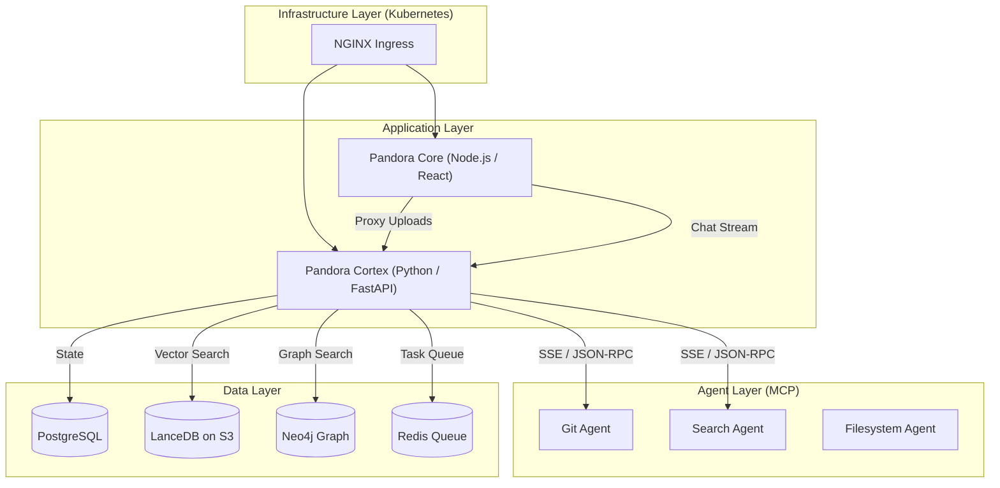

# System Architecture Overview

PandoraLM is an Enterprise-Grade Knowledge Operating System designed to move beyond simple "Chat with PDF" applications. It employs a **distributed Hub-and-Spoke architecture** to ensure scalability, security, and specialized processing.

## 🏗️ High-Level Architecture

The system is split into two primary microservices and a suite of distributed agents, all running within a Kubernetes cluster.



### 1. Pandora Core (The Hub)

**Role:** Orchestrator & UI

- **Tech Stack:** Node.js, React, Vite, TailwindCSS.
- **Responsibilities:**
  - Serves the Chat UI and Admin Console.
  - Handles User Session Management (Keycloak integration).
  - Acts as an API Gateway for file uploads (streaming directly to Cortex).
  - **Stateless:** Does not store vector data or perform heavy compute.

### 2. Pandora Cortex (The Brain)

**Role:** Heavy Compute & Reasoning Engine

- **Tech Stack:** Python 3.10+, FastAPI, Pydantic, Celery.
- **Responsibilities:**
  - **Cognitive Routing:** Decides *how* to answer a query (System 1 vs. System 2).
  - **Ingestion Pipeline:** Chunking, Embedding, and Graph Construction.
  - **Retrieval:** Hybrid Search (Vector + Graph) and Reranking.
  - **Agent Orchestration:** Manages tools via the Model Context Protocol (MCP).

### 3. The Data Layer

PandoraLM uses a "Polyglot Persistence" strategy:

| Component | Technology | Purpose |
|-----------|------------|---------|
| **Application State** | PostgreSQL | User preferences, workspace metadata, permissions (ReBAC). |
| **Vector Memory** | LanceDB (S3) | Fast, serverless vector search. Storage is decoupled from compute via S3. |
| **Knowledge Graph** | Neo4j | entity relationships (`(:Person)-[:WORKS_ON]->(:Project)`). |
| **Task Queue** | Redis | Async background jobs (ingestion, scraping) enabling KEDA autoscaling. |
| **Blob Storage** | MinIO (S3) | Raw files, audio streams (`/dev/shm` buffer), and LanceDB table files. |

## 🛡️ Security Architecture (ReBAC)

Security is not an afterthought; it is baked into the query pipeline via **Relationship-Based Access Control (ReBAC)**.

### Knowledge Layers

Data is partitioned logically, not physically. Every data point (Vector Chunk, Graph Node) is stamped with a `layer_id`.

- `system_public`: General knowledge available to all.
- `org_{id}`: Company-wide policies.
- `team_{id}`: Engineering or HR specific docs.
- `user_{id}`: Private notes and memory.

### The "Double-Check" Pattern

To prevent **TOCTOU (Time-of-Check Time-of-Use)** vulnerabilities in asynchronous workflows:

1. **API Check:** The API validates the JWT token when the request is received.
2. **Worker Check:** The Celery worker re-validates permission against the Postgres `LayerPermission` table *just before* execution.

```python
# In worker task
if not verify_layer_access_sync(user_id, layer_id):
    raise SecurityException("Access revoked")
```

## 🔌 Distributed Agent Architecture (MCP)

PandoraLM implements the **Model Context Protocol (MCP)** using a distributed, cloud-native approach.

- **Problem:** Standard MCP uses `stdio` (spawning child processes), which is insecure and unscalable in Kubernetes.
- **Solution:** **Networked MCP Bridges**.
  - Each Agent (e.g., Git, Google Search) runs in its own isolated Pod.
  - A "Bridge" container wraps the standard MCP CLI and exposes it via **Server-Sent Events (SSE)**.
  - Cortex connects to these agents over the internal cluster network.

This allows us to scale the "Research Agent" independently of the "Core API".
